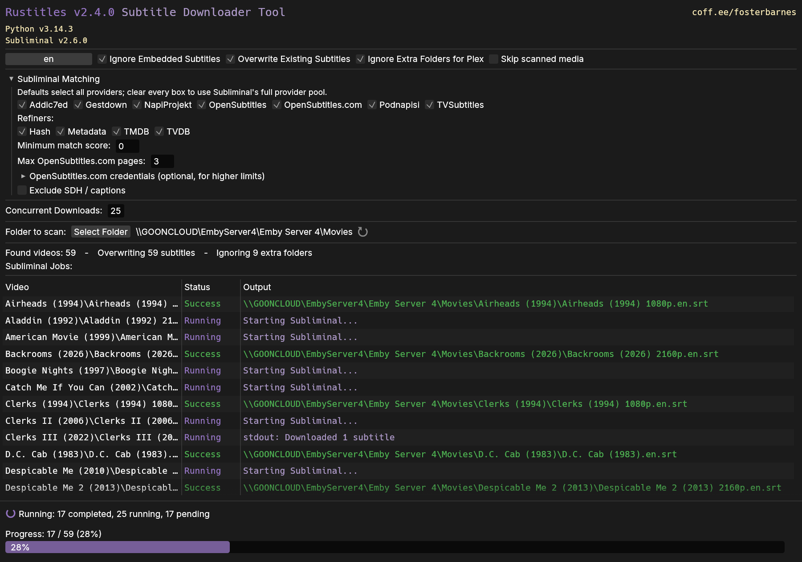

#  rustitles

Scans a given folder and automatically downloads subtitles in the selected language(s). Scans recursively in the given folder for all video files, if missing subtitles are found, they'll be downloaded. This is built with media servers in mind, so if you have a large library of movies/tv-shows, just select the root folder used for your media server and wait for it to complete. This is a portable cross-platform application.


## Downloads

<!-- Quick Reference -->

### Windows

<table border="0">
  <tbody>
    <tr>
      <td align="center" valign="top">
        <a href="https://github.com/fosterbarnes/rustitles/releases/download/v2.4.0/rustitles_win_x64_installer.exe">
          
        </a>
      </td>
      <td align="center" valign="top">
        <a href="https://github.com/fosterbarnes/rustitles/releases/download/v2.4.0/rustitles_win_x64_portable.exe">
          
        </a>
      </td>
    </tr>
    <tr>
      <td align="center" valign="top">
        <a href="https://github.com/fosterbarnes/rustitles/releases/download/v2.4.0/rustitles_win_ARM64_installer.exe">
          
        </a>
      </td>
      <td align="center" valign="top">
        <a href="https://github.com/fosterbarnes/rustitles/releases/download/v2.4.0/rustitles_win_ARM64_portable.exe">
          
        </a>
      </td>
    </tr>
  </tbody>
</table>

### macOS

<table border="0">
  <tbody>
    <tr>
      <td align="center" valign="top">
        <a href="https://github.com/fosterbarnes/rustitles/releases/download/v2.4.0/rustitles_app_macOS.zip">
          
        </a>
      </td>
      <td align="center" valign="top">
        <a href="https://github.com/fosterbarnes/rustitles/releases/download/v2.4.0/rustitles_app_macOS.zip">
          
        </a>
      </td>
    </tr>
  </tbody>
</table>

### Linux

<table border="0">
  <tbody>
    <tr>
      <td align="center" valign="top">
        <a href="https://github.com/fosterbarnes/rustitles/releases/download/v2.4.0/rustitles.deb">
          
        </a>
      </td>
      <td align="center" valign="top">
        <a href="https://github.com/fosterbarnes/rustitles/releases/download/v2.4.0/rustitles.AppImage">
          
        </a>
      </td>
    </tr>
  </tbody>
</table>

Or install the `.deb` directly from the terminal. This command will also automatically launch it after installing:

```bash
wget https://github.com/fosterbarnes/rustitles/releases/latest/download/rustitles.deb
sudo apt install ./rustitles.deb
rustitles
```

<!-- End Quick Reference -->

## Screenshot




## How do I use it?

Follow the on screen prompts and wait for Rustitles to install Subliminal after Python is available.

Select your desired language(s)

Set your maximum concurrent downloads or leave this number as default. This is the amount of subtitles that will be downloaded at the same time. (More concurrent downloads = more Python processes = more RAM used)

Select the folder with your movies/tv-shows that you want subtitles for

Wait for the processes to complete

### Virtual Machines

Certain OpenGL calls can cause issues in Windows VMs. Mesa 3d (an open source implementation of OpenGL) can be used to fix this issue on certain VMs, this fix works for me in VirtualBox. Just download [mesa3d-25.2.1-release-mingw.7z](https://github.com/pal1000/mesa-dist-win/releases/download/25.2.1/mesa3d-25.2.1-release-mingw.7z) or [mesa3d-25.2.1-release-msvc.7z](https://github.com/pal1000/mesa-dist-win/releases/download/25.2.1/mesa3d-25.2.1-release-msvc.7z) from <https://github.com/pal1000/mesa-dist-win/releases> unzip, and then run `systemwidedeploy.cmd` as admin, selecting "1. Core desktop OpenGL drivers".

### Extra Subliminal Matching Options

Fresh installs default to having all built-in providers selected (`addic7ed`, `gestdown`, `napiprojekt`, `opensubtitles`, `opensubtitlescom`, `podnapisi`, `tvsubtitles`). Configure as you'd like

OpenSubtitles.com pages are configurable in `Subliminal Matching` (text box, default 3, empty for unlimited)

`Hash`, `Metadata`, `TMDB`, and `TVDB` refiners are enabled by default. Toggle them in `Subliminal Matching` as needed  

Set a minimum match score to reject weak matches. `0` keeps Subliminal's default behavior.

### Optional API Credentials

OpenSubtitles.com credentials (optional, for higher limits) can be entered directly in `Subliminal Matching` - API key, username and password. They're stored locally next to the app on Windows (`rustitles_settings.json`) or under your XDG config directory on Linux/macOS (`settings.json` in the `rustitles` folder) and synced to Subliminal's `subliminal.toml` for compatibility. No key is baked into the app, you get your own free key at https://www.opensubtitles.com/api if you need one


## Why does this exist?

I spent about 45 minutes of my life trying to find a GUI utility for windows that would automatically scan a folder and download subtitles. All of the programs I found were either paid, did not work, confusing and bloated, or a command line tool. I then found Subliminal, and had the idea to create a simple GUI to accomplish basic tasks. I am teaching myself rust, so I decided to code in that language as a personal challenge.

This tool is here for the "me" of yesterday (you) who was trying to find a tool exactly like this lmao

## Dependencies

### Windows
[Microsoft Visual C++ Redistributable](https://aka.ms/vs/17/release/vc_redist.x64.exe),
[Python](https://www.python.org/downloads/),
[Subliminal](https://github.com/Diaoul/subliminal),
[FFmpeg](https://ffmpeg.org/about.html)

### Linux
[Python](https://www.python.org/downloads/),
[Pipx](https://github.com/pypa/pipx),
[Subliminal](https://github.com/Diaoul/subliminal),
[FFmpeg](https://ffmpeg.org/about.html)

### macOS
[Python](https://www.python.org/downloads/),
[Pipx](https://github.com/pypa/pipx),
[Subliminal](https://github.com/Diaoul/subliminal),
[FFmpeg](https://ffmpeg.org/about.html)

Rustitles will install Python and Subliminal for you if it isn't already available on Windows. On Linux and macOS, it will instruct you how to install dependencies if they aren't met.

If you prefer to install the tools manually:

**Windows**: Install the latest [Python](https://www.python.org/downloads/) and select "Add Python to PATH" during setup. Install the latest [Microsoft Visual C++ Redistributable](https://aka.ms/vs/17/release/vc_redist.x64.exe) as well. After both are installed, open Command Prompt or PowerShell and run `pip install subliminal`.

**Linux**: Install Python 3, pipx, and FFmpeg using your distribution's package manager. For Debian or Ubuntu, run `sudo apt install python3 pipx ffmpeg`. Then install Subliminal with `pipx install subliminal`.

**macOS**: If Homebrew is not installed, install it with the command from [brew.sh](https://brew.sh/). Then install Python 3, pipx, and FFmpeg with `brew install python pipx ffmpeg`. Run `pipx ensurepath`, restart your terminal, and install Subliminal with `pipx install subliminal`.

If you are unaware of Subliminal, it is a command line tool that uses python to find and download subtitles. If you prefer a CLI, just use Subliminal.

## Antivirus False Positives

Any app that isn't code-signed has a chance of tripping your antivirus (code signing is very, very expensive). If this happens, add "rustitles.exe" or the folder therein as an exclusion for your antivirus.

[How to set exclusions for Windows Defender](https://www.elevenforum.com/t/add-or-remove-exclusions-for-microsoft-defender-antivirus-in-windows-11.8797/#One)

Any detections seen can be false positives because the app checks for dependencies and can install Python on Windows if needed. That being said, ALWAYS be cautious when running scripts or .exe's from random people on GitHub.

## Support

If you have any issues, create an issue from the [Issues](https://github.com/fosterbarnes/rustitles/issues) tab and I will get back to you as quickly as possible.

If you'd like to support me, follow me on twitch:
https://www.twitch.tv/fosterbarnes

or if you're feeling generous drop a donation:
https://coff.ee/fosterbarnes

